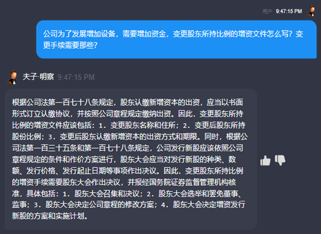
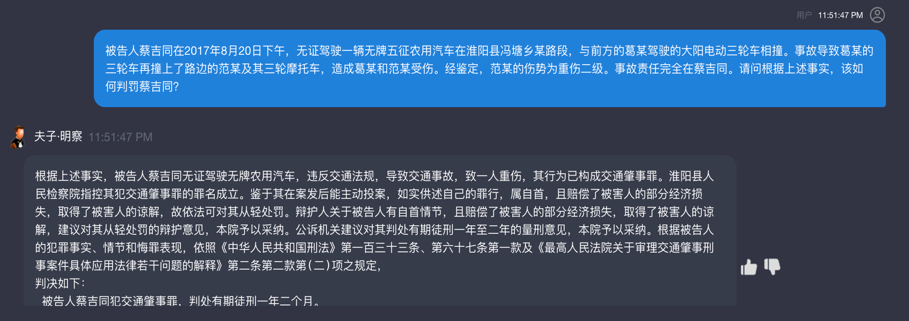
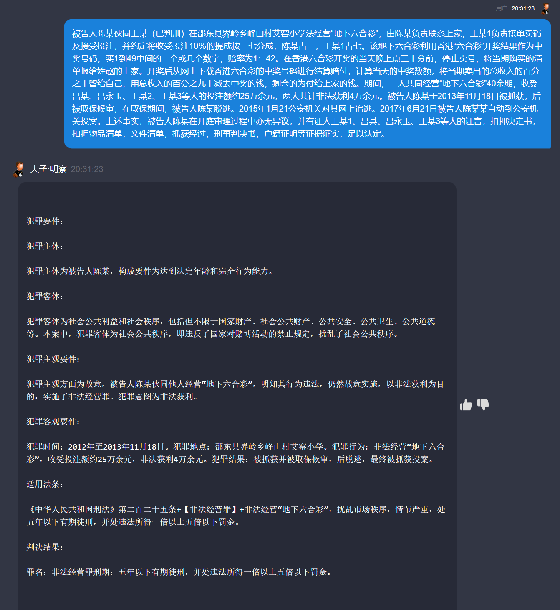
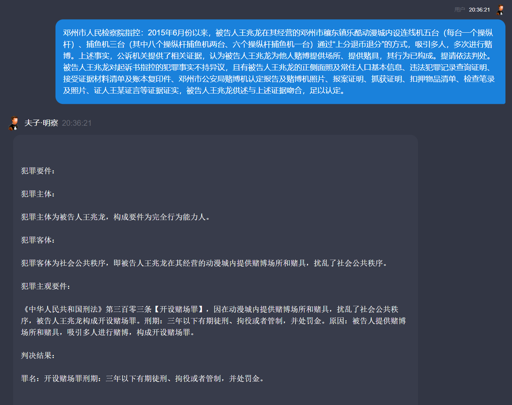
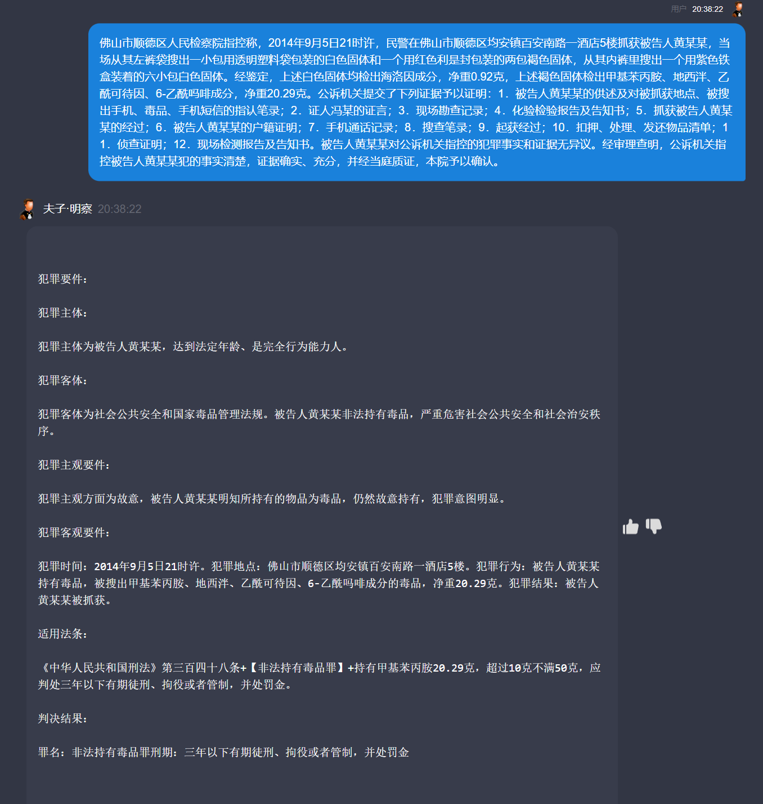

# 夫子•明察司法大模型
<div align="center">
  
[](https://huggingface.co/SDUIRLab/fuzi-mingcha-v1_0)
[](https://github.com/irlab-sdu/fuzi.mingcha/blob/main/LICENSE)
<br>
</div>


## 模型简介
夫子•明察司法大模型是由山东大学、浪潮云、中国政法大学联合研发，以 [ChatGLM](https://github.com/THUDM/ChatGLM-6B) 为大模型底座，基于海量中文无监督司法语料（包括各类判决文书、法律法规等）与有监督司法微调数据（包括法律问答、类案检索）训练的中文司法大模型。该模型支持法条检索、案例分析、三段论推理判决以及司法对话等功能，旨在为用户提供全方位、高精准的法律咨询与解答服务。

夫子•明察司法大模型具备如下三大特色：
- **基于法条检索回复** 夫子•明察大模型能够结合相关法条进行回复生成。对于用户的咨询，夫子•明察大模型基于生成式检索范式先初步引用相关法条，再检索外部知识库对所引法条进行校验与确认，最终结合这些法条进行问题分析与回复生成。这保证生成的回复能够基于与问题相关的法律依据，并根据这些依据提供深入的分析和建议，使回复具有高权威性、高可靠性与高可信性。

- **基于案例检索回复** 夫子•明察大模型能够基于历史相似案例对输入案情进行分析。大模型能够生成与用户提供的案情相似的案情描述及判决结果，通过检索外部数据库得到真实的历史案例，并将这些相似的历史案例的信息用于辅助生成判决。生成的判决参考相关案例的法律依据，从而更加合理。用户可以对照相似案例，从而更好地理解潜在的法律风险。
	
- **三段论推理判决** 司法三段论，是把三段论的逻辑推理应用于司法实践的一种思维方式和方法。类比于三段论的结构特征，司法三段论就是法官在司法过程中将法律规范作为大前提，以案件事实为小前提，最终得出判决结果的一种推导方法。针对具体案件，夫子•明察大模型系统能够自动分析案情，识别关键的事实和法律法规，生成一个逻辑严谨的三段论式判决预测。这个功能不仅提供了对案件可能结果的有力洞察，还有助于帮助用户更好地理解案件的法律依据和潜在风险。

我们已将夫子•明察的模型权重上传至 [HuggingFace/SDUIRLab](https://huggingface.co/SDUIRLab/fuzi-mingcha-v1_0)，模型的使用方法见 [#模型部署](#模型部署)。

## 公开评测效果
在 2023 年 9 月份由上海AI实验室联合南京大学推出的大语言模型司法能力评估体系[LawBench](https://github.com/open-compass/LawBench)中 (见下图)，我们在法律专精模型 (Law Specific LLMs) 中 Zero-Shot 表现出色，取得了**第一名**，与未经法律专业知识训练的 ChatGLM 相比有了较大提升。


## 训练数据
夫子•明察司法大模型的训练数据可分为两大类别：中文无监督司法语料以及有监督司法微调数据。其中不仅涵盖法律法规、司法解释、判决文书等内容，同时还包括各类高质量司法任务数据集，例如法律问答、类案检索和三段论式法律判决。内容丰富、优质海量的训练数据，确保了对司法领域知识进行准确且全面的覆盖，为夫子•明察司法大模型提供坚实的知识基础。

以下为夫子·明察司法大模型增量预训练、指令微调过程中所使用数据的统计信息：

<table class="tg" style="undefined;table-layout: fixed; width: 800px">
<colgroup>
<col style="width: 200px">
<col style="width: 200px">
<col style="width: 200px">
<col style="width: 200px">
</colgroup>
<thead>
  <tr>
    <th class="tg-9wq8" rowspan="2"><br>类型</th>
    <th class="tg-9wq8" rowspan="2"><br>名称</th>
    <th class="tg-9wq8" rowspan="2"><br>来源</th>
    <th class="tg-9wq8" rowspan="2"><br>数量</th>
  </tr>
  <tr>
  </tr>
</thead>
<tbody>
  <tr>
    <td class="tg-9wq8" rowspan="2">中文无监督司法语料</td>
    <td class="tg-9wq8">法律法规</td>
    <td class="tg-c3ow">LawRefBook</td>
    <td class="tg-9wq8">3.22M</td>
  </tr>
  <tr>
    <td class="tg-9wq8">裁判文书</td>
    <td class="tg-9wq8">裁判文书网</td>
    <td class="tg-9wq8">23M</td>

  </tr>
  <tr>
    <td class="tg-c3ow" rowspan="7">中文有监督司法微调数据</td>
    <td class="tg-9wq8" rowspan="3">法条检索回复数据</td>
    <td class="tg-c3ow">自主构建</td>
    <td class="tg-9wq8">32k</td>
  </tr>
  <tr>
    <td class="tg-c3ow">Lawyer LLaMA</td>
    <td class="tg-9wq8">11k</td>
  </tr>
  <tr>
    <td class="tg-c3ow">lawGPT</td>
    <td class="tg-9wq8">35k</td>
  </tr>
  <tr>
    <td class="tg-9wq8" rowspan="2">案例检索回复数据</td>
    <td class="tg-c3ow">自主构建</td>
    <td class="tg-9wq8">15k</td>
  </tr>
  <tr>
    <td class="tg-c3ow">CAIL</td>
    <td class="tg-c3ow">10k</td>
  </tr>
  <tr>
    <td class="tg-9wq8" rowspan="1">三段论推理判决数据</td>
    <td class="tg-c3ow">自主构建</td>
    <td class="tg-9wq8">11k</td>
  </tr>
  <tr>
    <td class="tg-9wq8" rowspan="1">多轮法律对话数据</td>
    <td class="tg-c3ow">Hanfei</td>
    <td class="tg-9wq8">40k</td>
  </tr>
  <tr>
    <td class="tg-c3ow" rowspan="3">通用领域微调数据</td>
    <td class="tg-9wq8">Alpaca指令微调数据</td>
    <td class="tg-c3ow">Alpaca</td>
    <td class="tg-9wq8">100K </td>
  </tr>
  <tr>
    <td class="tg-9wq8">Belle指令微调数据</td>
    <td class="tg-c3ow">Belle</td>
    <td class="tg-9wq8">10k </td>
  </tr>
  <tr>
    <td class="tg-9wq8">OL-CC指令微调数据</td>
    <td class="tg-c3ow">智源</td>
    <td class="tg-9wq8">10K </td>
  </tr>
  
</tbody>
</table>

以下部分自主构建的数据样例：

- 法条检索回复数据
```
# 法条询问
{
    "instruction": "",
    "input": "中华人民共和国义务教育法的第三十条是什么？",
    "output": "中华人民共和国义务教育法的第三十条规定如下\n教师应当取得国家规定的教师资格。\n国家建立统一的义务教育教师职务制度。教师职务分为初级职务、中级职务和高级职务。\n"
},
# 法条补全
{
    "instruction": "请补充以下法条缺失部分",
    "input": "高等教育自学考试暂行条例第十七条规定:\n高等教育自学考试的命题由全国考委统筹安排，分别采取全国统一命题、区域命题、省级命题三种办法",
    "output": "逐步建立题库，实现必要的命题标准化。\n试题(包括副题)及参考答案、评分标准启用前属绝密材料。"
},
# 根据案情生成相关法条
{
    "instruction": "请根据基本案情，给出适用的法条。",
    "input": "基本案情：\n广东省鹤山市人民检察院指控被告人李某甲于2014年7月7日9时许，在鹤山市宅梧镇双和公路宅梧收费站附近路段被民警抓获。民警当场从李某甲身上搜获搜获白色晶体38小包。经鉴定，从李某甲处缴获的白色晶体净重12.9克，检出甲基苯丙胺成分。被告人李某甲到案后如实供述自己的罪行，可以从轻处罚。建议对被告人判处有期徒刑六个月至一年六个月，并处罚金。提请法院依法惩处。上述事实，被告人李某甲在开庭审理过程中亦无异议，并有抓获被告人及破案的经过材料、被告人的供述、证人李X锋的证言、扣押物品清单、鉴定意见、辨认笔录、现场勘某足以认定。",
    "output": "适用法条：\n 《中华人民共和国刑法》第三百四十八条 【非法持有毒品罪】，李某甲非法持有甲基苯丙胺十克以上不满五十克，罪名成立，应判处三年以下有期徒刑，并处罚金。"
},
# 根据案情结合相关法条进行分析
{
    "instruction": "请根据以下案情进行判决并结合相关法律进行分析",
    "input": "基本案情：\n通过A公司经营的旅游App预定境外客房，支付方式为“到店支付”，订单下单后即被从银行卡中扣除房款，后原告未入住。原告认为应当到店后付款，A公司先行违约，要求取消订单。A公司认为其已经在服务条款中就“到店支付”补充说明“部分酒店住宿可能会对您的银行卡预先收取全额预订费用”，不构成违约，拒绝退款。\n邬某将A公司起诉至法院，请求判令退还预扣的房款。\n",
    "output": "裁判结果：\n经审理认为，对“到店支付”的通常理解应为用户到酒店办理住宿时才会支付款项，未入住之前不需要支付。即使该条款后补充说明部分酒店会“预先收取全额预订费用”，但对这种例外情形应当进行特别提示和说明，如果只在内容复杂繁多的条款中规定，不足以起到提示的作用，A公司作为预定服务的提供者应当承担责任。\n最终，法院支持邬某退还房款的诉讼请求。\n典型意义：\n字经济、互联网产业飞速发展的大背景下，线上交易中企业基本都采用格式条款的方式与消费者建立契约关系。但是，在格式条款发挥其便捷、高效、积极作用的同时，因其本身具有的单方提供、内容固定的特质所带来的问题和风险，也不容忽视。\n法律明确赋予了格式条款提供者进行提示说明的义务，民法典第四百九十六条规定：“提供格式条款的一方未履行提示或者说明义务，致使对方没有注意或者理解与其有重大利害关系的条款的，对方可以主张该条款不成为合同的内容。\n”提供格式条款的企业应当基于公平、诚信原则，依法、合理制定格式条款的内容，并对于履行方式等与消费者有重大利害关系的条款，向消费者进行特别的提醒和说明，从而维护交易秩序，平衡双方利益，促进行业发展。本案的裁判进一步厘清了网络服务提供者作为提供格式条款一方的责任，引导互联网交易模式更加符合契约自由和契约正义的精神。\n"
}

```

- 案例检索回复数据 

```
{
    "instruction": "请根据以下输入生成相关的案例和判决结果",
    "input": "被指控的人在某地某时盗走了三辆电动车。他有精神障碍，但被认定具备完全刑事责任能力。",
    "output": "基本案情：\n 河南省驻马店市驿城区人民检察院指控： 1.2016年4月12日13时许，被告人曹某某到驻马店市驿城区金雀路西段开发区高中院内4号楼前，将被害人刘某停放的一辆白色“高仕”牌电动车盗走。经鉴定，被盗电动车价值1064元。 2.2016年4月12日23时许，被告人曹某某到驻马店市驿城区金雀路西段开发区高中院内4号楼前，将被害人付某某停放的一辆白色“爱玛”牌电动车盗走。经鉴定，被盗电动车价值1320元。 3.2016年4月13日12时许，被告人曹某某到驻马店市驿城区金雀路西段开发区高中院内4号楼前，将被害人拜某某停放的一辆红色“高仕”牌电动车盗走。经鉴定，被盗电动车价值1200元。 另查明，案发后，公安机关接被害人报警后，通过查看案发现场监控和走访群众，确定上述三起电动车被盗均系被告人曹某某实施。 还查明，经驻马店安康法医精神病司法鉴定所鉴定，被告人曹某某系酒精所致精神障碍（依赖综合征），具备完全刑事责任能力，有受审能力。 上述事实，被告人曹某某在开庭审理过程中亦无异议，并有被害人陈述、证人证言、鉴定意见、物证照片、视听资料、到案经过、户籍证明等证据证实，足以认定。 \n本院认为，被告人曹某某以非法占有为目的，多次采取秘密手段窃取他人财物，价值3584元，数额较大，其行为已构成盗窃罪。公诉机关对曹某某犯罪指控成立，予以支持。曹某某有劣迹，其当庭自愿认罪，量刑时均可酌予考虑。根据曹某某犯罪的事实、性质、情节以及对社会的危害程度，依照《中华人民共和国刑法》第二百六十四条和第十八条第四款之规定，判决如下：\n 被告人曹某某犯盗窃罪，判处拘役五个月，并处罚金人民币二千元（罚金限判决生效后十日内缴纳）。 （刑期从判决执行之日起计算。判决执行以前先行羁押的，羁押一日折抵刑期一日。即自2016年4月13日起至2016年9月12日止）。 如不服本判决，可在接到判决书的第二日起十日内，通过本院或者直接向驻马店市中级人民法院提出上诉。书面上诉的，应当提交上诉状正本一份，副本二份。"
}
```

- 三段论推理判决数据

```
{
    "instruction": "请根据基本案情，利用三段论的推理方式得到判决结果，判决结果包括：1.罪名；\n2.刑期。",
    "input": "基本案情：\n广东省鹤山市人民检察院指控被告人李某甲于2014年7月7日9时许，在鹤山市宅梧镇双和公路宅梧收费站附近路段被民警抓获。民警当场从李某甲身上搜获搜获白色晶体38小包。经鉴定，从李某甲处缴获的白色晶体净重12.9克，检出甲基苯丙胺成分。被告人李某甲到案后如实供述自己的罪行，可以从轻处罚。建议对被告人判处有期徒刑六个月至一年六个月，并处罚金。提请法院依法惩处。上述事实，被告人李某甲在开庭审理过程中亦无异议，并有抓获被告人及破案的经过材料、被告人的供述、证人李X锋的证言、扣押物品清单、鉴定意见、辨认笔录、现场勘某足以认定。",
    "output": "犯罪要件：\n犯罪主体：\n 犯罪主体为被告人李某甲，构成要件为完全行为能力人。\n    犯罪客体：\n 犯罪客体为社会公共安全，包括禁毒法规所保护的社会关系。被告人李某甲非法持有、贩卖毒品，严重危害社会公共安全，破坏社会治安秩序。\n    犯罪主观要件：\n 犯罪主观方面为故意，李某甲明知所持有的白色晶体为甲基苯丙胺，仍然故意贩卖毒品。犯罪意图为非法牟利。\n    犯罪客观要件：\n 犯罪时间：2014年7月7日9时许。犯罪地点：广东省鹤山市宅梧镇双和公路宅梧收费站附近路段。犯罪行为：携带白色晶体38小包，净重12.9克，检出甲基苯丙胺成分。犯罪结果：被民警抓获。\n    适用法条：\n 《中华人民共和国刑法》第三百四十八条 【非法持有毒品罪】，李某甲非法持有甲基苯丙胺十克以上不满五十克，罪名成立，应判处三年以下有期徒刑，并处罚金。 \n    判决结果：\n 罪名：非法持有毒品罪刑期：三年以下有期徒刑，并处罚金。 "
},
```

注：其中我们自主构建的数据集，如三段论推理判决数据集等，将会在近期以论文的形式公开，感谢您的关注和理解。

## 效果展示
以下为夫子·明察三大特色的效果展示：<br>
<details>
<summary><b>基于法条检索回复</b></summary>
	



</details>


<details>
<summary><b>基于案例检索回复</b></summary>
	


</details>


<details>
<summary><b>三段论推理判决</b></summary>
	





</details>


<br>以下为夫子·明察与其他法律大模型、ChatGLM的效果对比：<br>

<details>
<summary><b>法律咨询</b></summary>
	
**Query：政府公务员可以成为企业合伙人吗？**
| **Model** | **Response** |
| :--------: | -- |
| 夫子•明察<br>（模型直接回复） | 政府公务员不能成为企业合伙人，因为政府公务员的职责是为人民服务，而不是为自己谋取利益。在企业合伙过程中，政府公务员不能利用自己的职权和影响力来干预企业的经营管理，也不能参与企业的利润分配。如果政府公务员想要成为企业合伙人，需要符合相关法律法规的规定，取得相应的资格和条件。 |
| 夫子•明察<br>（经过法条检索） | 不可以。根据《中华人民共和国合伙企业法》第九条规定，申请设立合伙企业时，应当向企业登记机关提交登记申请书、合伙协议书、合伙人身份证明等文件。其中，合伙人为国家机关工作人员的，应当提交其职务证明文件，并注明其委派代表的职务。因此，政府公务员不能成为企业合伙人。 |
| 其他法律模型 | 根据《中华人民共和国公务员法》第X条规定，公务员离开原任职务后，可以在一定期限内从事与原任职务有关的工作，但不得利用原任职务或者职权从事营利活动。因此，政府公务员可以成为企业合伙人，但必须符合上述规定，不能利用原任职务或职权从事营利活动。|
| ChatGLM | 公务员不可以成为企业合伙人，因为公务员身份和职业责任不允许从事营利性活动，包括成为企业合伙人。根据《公务员法》的规定，公务员必须履行工作职责，同时遵守职业道德和职业操守，不得从事与工作无关的活动，也不得利用职务之便谋取私利。公务员之间也不得建立商业关系或者成为合伙人。公务员成为企业合伙人可能会违反法律法规，不仅会影响公务员的形象和信誉，也会损害政府的公信力和形象。因此，政府公务员不得成为企业合伙人。|
</details>


<details>
<summary><b>案例分析</b></summary>
	

**Query：分析案例：徐某（男）与李某（女）婚后育有一子（1岁半）、一女（8岁），两人准备离婚，都想争取孩子抚养权。徐某经济状况较好，工资收入是李某的数倍，认为自己胜券在握。李某虽收入不高，但女儿更愿意随其生活。**
| **Model** | **Response** |
| :--------: | -- |
| 夫子•明察 | 根据《民法典》第一千零八十四条规定，离婚后，子女无论由父或母直接抚养，仍是父母双方的子女。离婚后，父母对于子女仍有抚养、教育、保护的权利和义务。<br>根据《民法典》第一千零八十五条规定，离婚后，子女由一方直接抚养的，另一方应当负担部分或全部抚养费。负担费用的多少和期限的长短，由双方协议；协议不成的，由人民法院判决。<br>根据《民法典》第一千零八十六条规定，离婚后，不直接抚养子女的父或母，有探望子女的权利，另一方有协助的义务。行使探望权利的方式、时间由当事人协议；协议不成的，由人民法院判决。<br>在本案中，徐某与李某都想争取孩子抚养权，应当根据最有利于未成年子女的原则依法判决。如果双方不能达成协议，应当由人民法院依照相关规定进行判决。此外，由于女儿还在上学，生活费用和抚养费用可能会增加，应当根据实际情况进行适当的调整。|
| 其他法律模型 | 根据《中华人民共和国婚姻法》的规定，子女抚养权的判决应当以未成年子女的利益为出发点，综合考虑父母的经济条件、身体情况、家庭环境等情况，最终确定抚养人。因此，在本案中，法院会综合考虑双方的经济能力、工作时间、居住环境等因素来判断抚养权归属问题。<br>首先，徐某的经济条件好，收入水平较高，可以为孩子的成长提供更好的物质条件。但是，如果李某能够证明自己有更好的照顾孩子的能力，或者孩子的身心健康需要由她来照顾，那么她也有可能获得抚养权。<br>其次，女儿年龄较大，已经八岁，对于她的意愿也应该有所考虑。如果女儿表示愿意随母亲生活，法院也会考虑到这一因素。<br>综上所述，在本案中，法院会综合考虑双方的经济能力、照顾孩子的能力、女儿的意愿等因素来判决抚养权归属问题。建议双方积极沟通协商，尽量达成一致意见，并在法律程序中维护自己的合法权益。|
| ChatGLM | 这个案例涉及到孩子抚养权的问题，需要考虑多个因素来做出决定。以下是一些分析和建议：<br>1. 孩子的年龄和需求：孩子在不同的年龄段有不同的需求和特点。1岁半的孩子通常需要关注他们的日常生活，如饮食、睡眠、安全等。8岁的孩子已经进入了青春期，需要更多的关 注和支持，以帮助他们发展社交技能和情感健康。因此，抚养权的归属需要考虑孩子的需求和年龄。<br>...<br>综合以上因素，如果徐某的经济状况更好，并且孩子更愿意跟李某生活，那么李某可能会获得孩子的抚养权。但最终结果还需要根据法律程序来裁决，因此，建议双方在法律框架内进行沟通和协商，以达成一个最好的解决方案。|

---

**Query：21 岁女子甲与25 岁男子乙在网上聊天后产生好感，乙将甲发给其的私密照片保存。后乙要求与甲结婚,甲不同意。乙威胁要公布其照片，甲只好同意结婚并办理了登记。甲是否可以自婚姻登记之日起 1年内请求撤销该婚姻？**

| **Model** | **Response** |
| :--------: | -- |
| 夫子•明察 | 据《民法典》第一千零五十二条规定，如果甲因胁迫结婚，可以在结婚登记之日起一年内请求撤销婚姻。而根据《民法典》第一千零五十三条规定，如果乙在甲办理结婚登记前泄露甲的私密照片，会对甲造成精神上的伤害，也会对甲的撤销请求权产生影响。因此，如果乙在甲办理结婚登记前泄露甲的私密照片，甲可以向人民法院请求撤销婚姻。但需要注意的是，请求撤销婚姻的，应当自胁迫行为终止之日起一年内提出。如果甲被乙威胁要公布其照片，甲也可以在结婚登记之日起一年内请求撤销该婚姻。|
| 其他法律模型 | 依据《民法典》第一千零五十二条规定，因胁迫结婚的，受胁迫的一方可以向人民法院请求撤销婚姻。因此，如果甲是在受到胁迫的情况下同意结婚的，那么甲可以在自婚姻登记之日起一年内向人民法院请求撤销婚姻。但是，需要进一步了解的是，是否存在胁迫的情况，以及胁迫的方式和手段等。<br>另外，根据《民法典》第一千零四十六条规定，结婚应当男女双方完全自愿，禁止任何一方对另一方加以强迫，禁止任何组织或者个人加以干涉。如果甲是在完全自愿的情况下同意结婚的，那么甲无法请求撤销婚姻。<br>综上所述，需要进一步了解甲同意结婚的具体情况，以及是否存在胁迫的情况。建议甲咨询专业律师，寻求专业的法律帮助。|
| ChatGLM | 根据中国《婚姻法》的规定，婚姻关系是自婚姻开始时即存在的，非经法定程序而不能消灭。婚姻无效的原因有：(一)重婚的；(二)有禁止结婚的疾病而结婚无效的；(三)因胁迫而结婚无效的；(四)自始没有感情而结婚无效的；(五)因欺诈而结婚无效的。婚姻无效、可依法撤销。甲可以自婚姻登记之日起 1 年内向当地人民法院提起撤销婚姻的诉讼。|

</details>

## 模型部署

模型的部署和使用请参考 [src/cli_demo.py](src)


## 致谢

本项目基于或参考如下开源项目，在此对相关项目和开发人员表示感谢：

- [Alpaca](https://github.com/tatsu-lab/stanford_alpaca)
- [BELLE](https://github.com/LianjiaTech/BELLE)
- [ChatGLM-6B](https://github.com/THUDM/ChatGLM-6B)
- [ChatGLM-Efficient-Tuning](https://github.com/hiyouga/ChatGLM-Efficient-Tuning)
- [Lawyer LLaMA](https://github.com/AndrewZhe/lawyer-llama)
- [LaWGPT](https://github.com/pengxiao-song/LaWGPT)
- [JEC-QA](https://jecqa.thunlp.org/)
- [PKU Opendata](https://opendata.pku.edu.cn/dataset.xhtml?persistentId=doi:10.18170/DVN/OLO4G8)
- [LawRefBook](https://github.com/RanKKI/LawRefBook)
- [CAIL 2018-2021](https://github.com/china-ai-law-challenge)
- [HanFei](https://github.com/siat-nlp/HanFei)
- [BAAI](https://data.baai.ac.cn/details/OL-CC)


## 声明

本项目的内容仅供学术研究之用，不得用于商业或其他可能对社会造成危害的用途。
在涉及第三方代码的使用时，请切实遵守相关的开源协议。
本项目中大模型提供的法律问答、判决预测等功能仅供参考，不构成法律意见。
如果您需要法律援助等服务，请寻求专业的法律从业者的帮助。

## 协议

本仓库的代码依照 [Apache-2.0](LICENSE) 协议开源，我们对 ChatGLM-6B 模型的权重的使用遵循 [Model License](https://github.com/THUDM/ChatGLM-6B/blob/main/MODEL_LICENSE)。

## 引用

如果本项目有帮助到您的研究，请引用我们：
```
@misc{fuzi.mingcha,
  title={fuzi.mingcha},
  author={Shiguang Wu, Zhongkun Liu, Zhen Zhang, Zheng Chen, Wentao Deng, Wenhao Zhang, Jiyuan Yang, Zhitao Yao, Yougang Lyu, Xin Xin, Shen Gao, Pengjie Ren, Zhaochun Ren, Zhumin Chen}
  year={2023},
  publisher={GitHub},
  journal={GitHub repository},
  howpublished={\url{https://github.com/irlab-sdu/fuzi.mingcha}},
}
```
